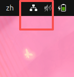
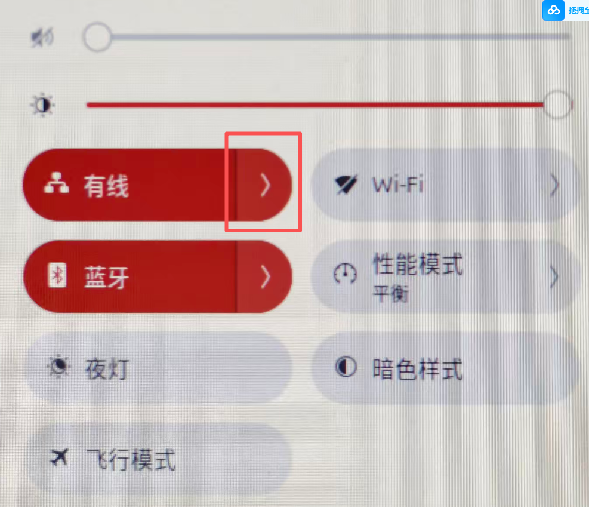
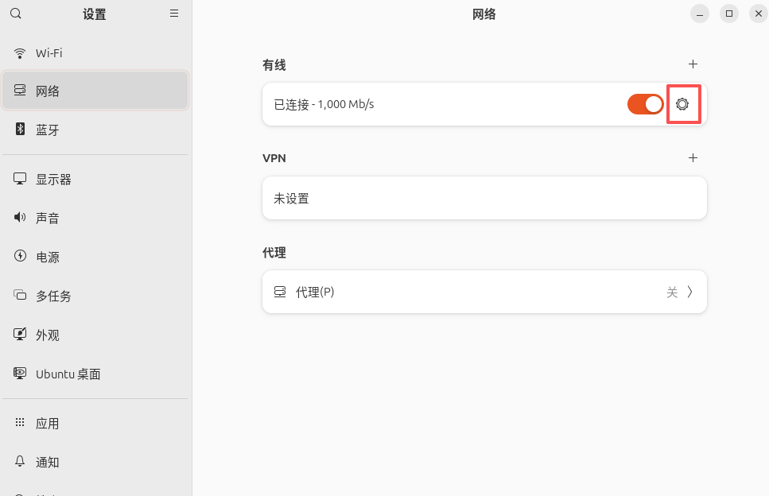
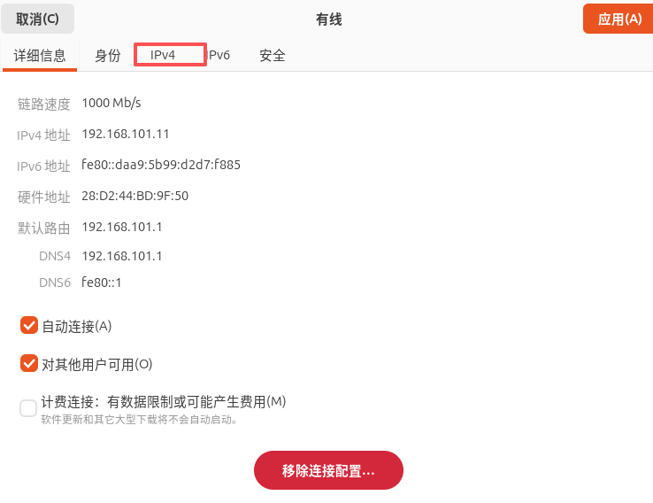
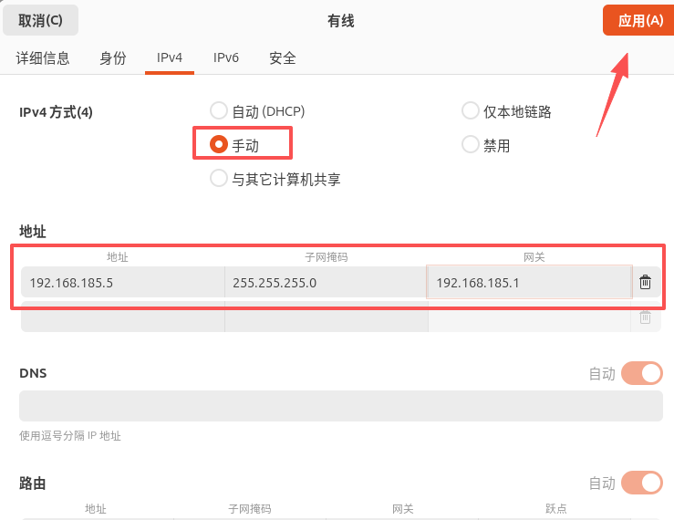
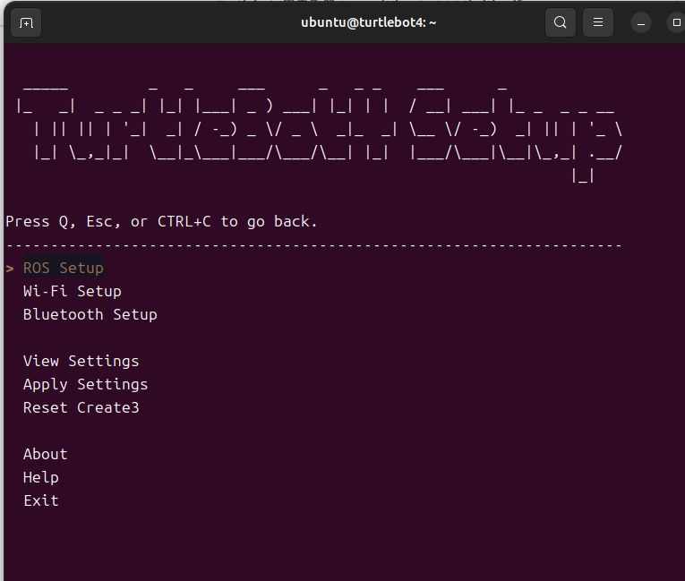
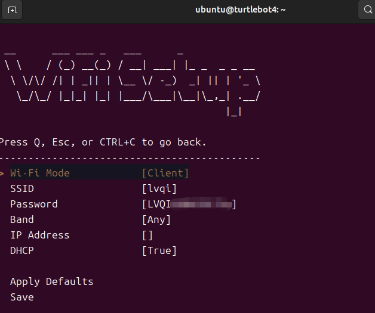
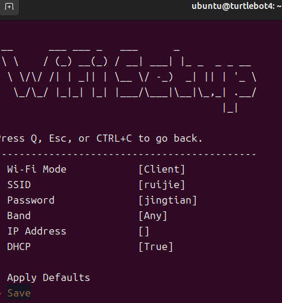
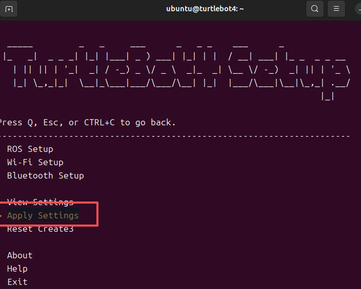
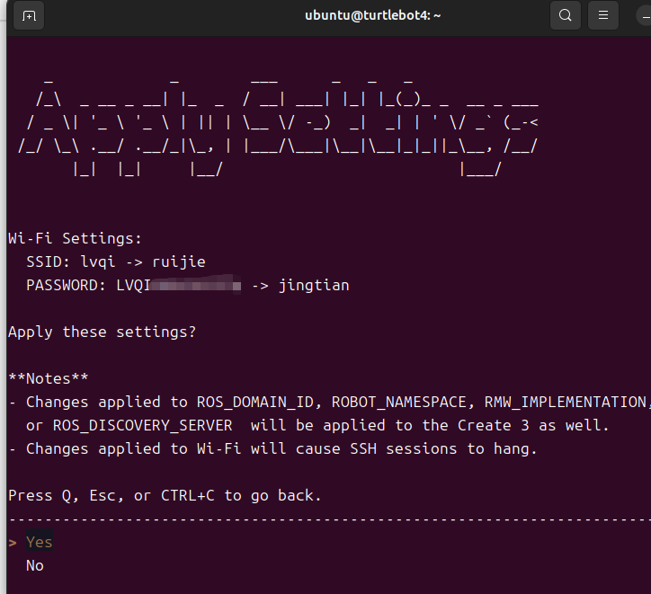

# 连接网线
将网线的一段连接至电脑，一段连接至turtlebot4机器人。

# 本机网络设置
点击Linux桌面右上角有线连接图标



然后选择这个，然后点击有线设置。





点击右边设置图标





选择IPv4





ipv4方式选择手动，采用静态IP。ipv4地址，子网掩码，网关部分照抄即可，最后点击应用。




# turtlebot4端设置
此时，通过以下指令即可连接至turtlebot4,
```
ssh ubuntu@192.168.185.3
```
密码
```
turtlebot4
```

连接成功后，终端输入，运行turtlebot4设置工具
```
turtlebot4-setup
```
在以下界面按⬇️，选择WIFI setup，然后点击回车
    
在当前界面可以看到当前的WIFI配置。
SSID是WIFI名，Password是WIFI的密码。
如果要更换同样是按⬇️键。然后分别选择SSID和Password，输入你要连接的WIFI即可。



比如我修改SSID为`ruijie`，密码为`jingtian`.



修改完成后选择save，然后回车，会提示你输一次密码。然后接着选择`Apply Settings`。



然后回输出修改的内容，然后选择yes即可。之后等待机器人重启完成后就可以连接到新设置的WiFi了。

